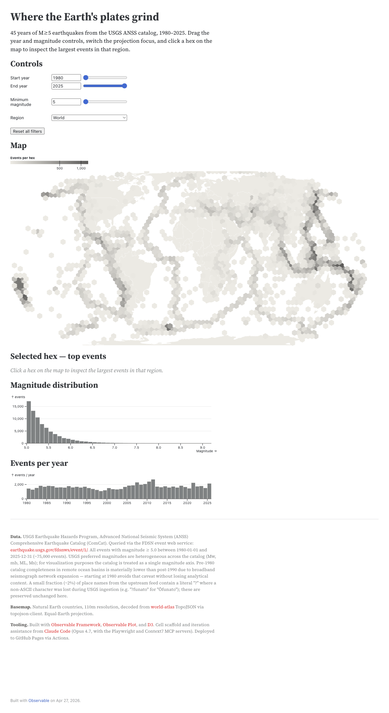

<!--
Build: `quarto render portfolio.qmd` from the portfolio/ folder.
Requires: Quarto + xelatex + Inter font installed (or change mainfont).
Page layout: A4 landscape (297 × 210 mm) with 15–18 mm margins.

Workflow notes:
- Each task gets a `\newpage` so it starts on its own sheet.
- Keep sections in the fixed order defined in CLAUDE.md (1 → 18).
- Reference page (task 18) is assembled from reference_log.md at the end.
-->

\newpage

# Task 1 — Critique of a Manipulative Visualization

```{=latex}
\noindent\begin{minipage}[t]{0.52\textwidth}
\vspace{0pt}\centering
\includegraphics[width=\linewidth,height=0.78\textheight,keepaspectratio]{../data/task_01/bad_example.jpeg}

\vspace{0.4em}
{\footnotesize\color{darkstone}\itshape Source: \url{https://x.com/WhiteHouse/status/2017370992436249025}}
\end{minipage}\hfill\begin{minipage}[t]{0.44\textwidth}
\vspace{0pt}
```

*The most obvious issue is the truncated y-axis, which exaggerates the perceived change in steel production and creates an immense lie factor. On top of overstating the change, the chart also uses color encoding to further mislead the viewer. They make the fill of the prior year red and that of 2025 green, which in western societies conveys positive sentiment. They also add a green font to the "INCREASES" to really convey a positive development. They additionally cherry-pick a two-year comparison, which is not representative of the historical range of US steel production. Two data points are not enough to tell a story. A minor issue I don't like either is the naming of the x-axis, where in one instance the year is at the start and in another at the end.*

```{=latex}
\end{minipage}
```

\newpage

# Task 2 — Improved Version

```{=latex}
\begin{center}
{\fontsize{14pt}{17pt}\selectfont\color{onyx}\textbf{US raw steel production is 41\% below its 1973 peak --- and the 2024--2025 increase is noise.}}\\[0.4em]
{\fontsize{11pt}{14pt}\selectfont\color{alloy} Annual US raw steel production, 1970--2025. Output peaked in 1973 and roughly halved by the mid-1980s; it has plateaued near 80\,Mt since 2010. The 2024--2025 increase falls well inside the year-to-year noise of every decade since.}
\end{center}
```

{fig-align="center" width="92%"}

```{=latex}
\begin{center}
{\footnotesize\color{darkstone}\itshape Sources: USGS Data Series 140, ``Iron and Steel Statistics'' (1900--2021); World Steel Association, P1 crude steel total, USA (2021--2025). \url{https://www.usgs.gov/centers/national-minerals-information-center/historical-statistics-mineral-and-material-commodities} \quad \url{https://worldsteel.org/data/annual-production-steel-data/}}
\end{center}
```

\newpage

# Task 3 — Critique of a Particularly Good Visualization

```{=latex}
\noindent\begin{minipage}[t]{0.52\textwidth}
\vspace{0pt}\centering
\includegraphics[width=\linewidth,height=0.78\textheight,keepaspectratio]{../data/task_03/rare_earths_di.png}

\vspace{0.4em}
{\footnotesize\color{darkstone}\itshape Source: \url{https://ourworldindata.org/data-insights/brazil-india-vietnam-and-russia-hold-large-reserves-of-rare-earth-but-mine-very-little-of-them}}
\end{minipage}\hfill\begin{minipage}[t]{0.44\textwidth}
\vspace{0pt}
```

*This is a good visualization because it tells a clear story. This story is supported by the fact that the maker chose to sort the reserves by descending order, making the disparity between reserves and production immediately apparent. The chart uses color, but in a good way that makes the distinction between the two variables easy to see. The axis is not truncated and the bars lengths faithfully represent the data.*

*There are some minor issues worth mentioning though. The visualization uses "selected countries" for the visualization, which leaves me to question what criteria determined which countries were included. The graph also shows percentages <0.1% which then are not truthful to the size of the bars. Finally, they include a measure of a country that does not have recorded reserves. This makes it questionable whether this is a valid data point.*

```{=latex}
\end{minipage}
```

\newpage

# Task 4 — Climate-change Visualization

```{=latex}
\begin{center}
{\fontsize{14pt}{17pt}\selectfont\color{onyx}\textbf{Swiss glaciers have lost mass every year for 32 straight years.}}\\[0.4em]
{\fontsize{11pt}{14pt}\selectfont\color{alloy} Annual mass balance across Switzerland's monitored glaciers, area-weighted, 1956--2025. The annual loss rate has roughly tenfolded since the 1960s; recent years (2022--2025) average $-1.9$\,m water equivalent per year against $-0.18$ for 1956--1989. Three near-zero years (1956, 1967, 1993) are rendered at minimum visible height so no observation reads as a missing year.}
\end{center}
```

{fig-align="center" width="85%"}

```{=latex}
\begin{center}
{\footnotesize\color{darkstone}\itshape Source: GLAMOS (2025), Swiss Glacier Mass Balance, release 2025. \url{https://doi.glamos.ch/data/massbalance/massbalance_2025_r2025.html}}
\end{center}
```

\newpage

# Task 5 — Black-and-white Visualization

```{=latex}
\begin{center}
{\fontsize{14pt}{17pt}\selectfont\color{onyx}\textbf{The four deadliest years in 35 years of UCDP records are all 2021--2024.}}\\[0.4em]
{\fontsize{11pt}{14pt}\selectfont\color{alloy} Global battle-related deaths in state-based armed conflicts, 1989--2024 (UCDP best estimate). The 2022 peak (Ukraine + Tigray) is the highest annual value the dataset has recorded; 2021, 2023, and 2024 round out the top four.}
\end{center}
```

{fig-align="center" width="85%"}

```{=latex}
\begin{center}
{\footnotesize\color{darkstone}\itshape Source: UCDP (2025), Battle-Related Deaths Dataset v25.1, Uppsala Conflict Data Program. \url{https://ucdp.uu.se/downloads/}}
\end{center}
```

\newpage

# Task 6 — Color as an Important Aesthetic

```{=latex}
\begin{center}
{\fontsize{14pt}{17pt}\selectfont\color{onyx}\textbf{Wind and solar replaced coal in Europe --- but China and India are still coal-anchored.}}\\[0.4em]
{\fontsize{11pt}{14pt}\selectfont\color{alloy} Share of electricity generation by fuel category, ten countries, 2000--2025. Sweden and France remain low-carbon throughout (nuclear, hydro). Germany, Denmark, and the UK rebuilt their grids on wind and solar. Coal still supplies more than half of generation in China, India, and Poland.}
\end{center}
```

{fig-align="center" width="95%"}

```{=latex}
\begin{center}
{\footnotesize\color{darkstone}\itshape Source: Ember (2025), Yearly Electricity Data. \url{https://ember-energy.org/data/yearly-electricity-data/}}
\end{center}
```

\newpage

# Task 7 — Maximum Data-ink Ratio (Tufte)

```{=latex}
\begin{center}
{\fontsize{14pt}{17pt}\selectfont\color{onyx}\textbf{The SNB cut its policy rate back to zero in March 2026.}}\\[0.4em]
{\fontsize{11pt}{14pt}\selectfont\color{alloy} Swiss National Bank policy rate, monthly, 2000--2026. Pre-GFC peak 2.75\% (Sep 2007); eight years below zero (Dec 2014 -- Sep 2022, trough $-0.75$\%); a brief hike to 1.75\% (Jun 2023); and now back to zero --- the lowest setting since exit.}
\end{center}
```

{fig-align="center" width="92%"}

```{=latex}
\begin{center}
{\footnotesize\color{darkstone}\itshape Source: Swiss National Bank, ``Official rates of the SNB'' (cube \texttt{snboffzisa}). Spliced: 3-month CHF LIBOR target band mid (pre-Jun 2019) + SNB Leitzins (Jun 2019$+$). \url{https://data.snb.ch/}}
\end{center}
```

\newpage

# Task 8 — Non-standard Chart Type

```{=latex}
\begin{center}
{\fontsize{14pt}{17pt}\selectfont\color{onyx}\textbf{Less than 10\% of the world's plastic waste is recycled.}}\\[0.4em]
{\fontsize{11pt}{14pt}\selectfont\color{alloy} Global plastic waste reaching end-of-life in 2019, by use sector and fate. Of 353\,Mt of post-use waste, only 33\,Mt --- 9\% --- was recycled. Half went to landfill; almost a quarter (79\,Mt) leaked into the environment as mismanaged waste.}
\end{center}
```

{fig-align="center" width="92%"}

```{=latex}
\begin{center}
{\footnotesize\color{darkstone}\itshape Source: Our World in Data, \emph{Plastic Pollution} (extending Geyer, Jambeck \& Law 2017, \textit{Science Advances}). \url{https://ourworldindata.org/plastic-pollution}}
\end{center}
```

\newpage

# Task 9 — Visualization of Textual Data

```{=latex}
\begin{center}
{\fontsize{14pt}{17pt}\selectfont\color{onyx}\textbf{American inaugural sentences have shrunk from over 60 words to under 20 in 235 years.}}\\[0.4em]
{\fontsize{11pt}{14pt}\selectfont\color{alloy} Average words per sentence in each US presidential inaugural address, 1789--2025. Washington opened with 62 words per sentence (Latinate, periodic prose); Biden's 2021 address ran at 11 --- the lowest in the dataset. The decline is structural, not just shorter speeches: long, clause-stacked sentences disappeared from the lectern, replaced by short, conversational lines.}
\end{center}
```

{fig-align="center" width="88%"}

```{=latex}
\begin{center}
{\footnotesize\color{darkstone}\itshape Source: US presidential inaugural addresses, 1789--2025, via the \texttt{quanteda} R package corpus \texttt{data\_corpus\_inaugural} (compiled from Bartleby.com and the Miller Center / American Presidency Project). Sentence and word counts computed with quanteda's tokenizer. \url{https://millercenter.org/the-presidency/presidential-speeches}}
\end{center}
```

\newpage

# Task 10 — Hand-drawn Visualization

```{=latex}
\vspace*{\fill}
\begin{center}
{\fontsize{12pt}{15pt}\selectfont\color{darkstone}\itshape Hand-drawn visualization to be inserted here.}
\end{center}
\vspace*{\fill}
```

\newpage

# Task 11 — Data Map

```{=latex}
\begin{center}
{\fontsize{14pt}{17pt}\selectfont\color{onyx}\textbf{The world's median age splits cleanly along the demographic transition.}}\\[0.4em]
{\fontsize{11pt}{14pt}\selectfont\color{alloy} Median age by country, 2023. Sub-Saharan Africa runs under 20; North America and most of Europe sit above 38. Italy, Germany, Japan, and South Korea are all above 45 --- and aging fast. Equal-area Eckert IV projection so country size on the page equals country size on the ground.}
\end{center}
```

{fig-align="center" width="92%"}

```{=latex}
\begin{center}
{\footnotesize\color{darkstone}\itshape Source: UN Department of Economic and Social Affairs, Population Division, \emph{World Population Prospects 2024} (medium variant, estimates), via Our World in Data. \url{https://ourworldindata.org/grapher/median-age}}
\end{center}
```

\newpage

# Task 12 --- Interactive: 45 Years of Earthquakes

```{=latex}
\begin{center}
{\fontsize{14pt}{17pt}\selectfont\color{onyx}\textbf{Where the Earth's plates actually grind: 45 years of M$\geq$5 earthquakes.}}\\[0.4em]
{\fontsize{11pt}{14pt}\selectfont\color{alloy} Year-range slider, magnitude threshold, region focus, and click-a-hex for the top events in that region. The Pacific Ring of Fire, Mediterranean--Himalaya belt, Mid-Atlantic Ridge, and East African Rift emerge only when 45 years of seismicity are allowed to accumulate. Hosted on GitHub Pages via Observable Framework.}
\end{center}
```

{fig-align="center" width="62%"}

```{=latex}
\begin{center}
{\fontsize{11pt}{14pt}\selectfont\color{alloy} Try it live: \url{https://alexander-the-sufficient.github.io/data_vizualisation_with_ai/task_12/}}
\end{center}
```

```{=latex}
\begin{center}
{\footnotesize\color{darkstone}\itshape Source: USGS Earthquake Hazards Program, ANSS Comprehensive Earthquake Catalog (ComCat), via the FDSN event web service. \url{https://earthquake.usgs.gov/fdsnws/event/1/}}
\end{center}
```

\newpage
